**University of Pennsylvania, CIS 565: GPU Programming and Architecture,
Final Project - GPU Robust PointCloud SLAM with Particle Filter **

* Michael Willett
* Tested on: Windows 10, I5-4690k @ 3.50GHz 16.00GB, GTX 750-TI 2GB (Personal Computer)

## Contents
1. [Introduction](#intro)
2. [Particle Filter Algorithm](#part1)
3. [Loop Closure](#part2)
3. [Moving From 2D to 3D](#part3)
3. [Error Correction with Regression](#part4)
3. [Performance Analysis](#part5)
3. [References](#reference)
6. [Build Instructions](#appendix)

<a name="intro"/>
## Introduction: Particle Filters
One of the biggest challenges in robotics operating in social environments is the task of building a map of
the region and accurating identifying where the robot is (known as Simultanious Localization and Mapping, or SLAM). 
Since the late 90's, one of the most successful algorithms for solving this problem is using a particle filter to 
estimate the robot position relative to its observations, and build the map successively as new measurements are made. 
A particle filter in its simplest form is a Monte Carlo estimation of the current robot state. By creating a large 
number of potential robot positions and checking each one relative to past knowledge, accurate estimates of true 
coordinates can be achieved without complex regression fitting of sensor data.

The biggest limitation of particle filters is that for a large amount of particles, CPU implementation is incredibly 
costly. To compensate for this, historically SLAM algorithms relied heavily on good robot odometry to create a prior
on the distribution using dead-reckoning. However, as mobile graphics processors become more viable for robotic applications
increasing the particle count becomes a great way to improve estimation accuracy without siginificant runtime increase.
In fact, the particle filter algorithm for SLAM can be considered embarassingly parallel in implementation, and accurate
results can be achieved from visual sensor data only, without any need to develop a prior with robot odometry.

<a name="part1"/>
## Section 1: Basic Particle Filter SLAM Algorithm

The Particle Filter algorithm can be broken into six basic steps:

1. Disperse all particles with gaussian random noise.
2. For each particle, calculate which grid cells the sensor detects an obsticle in, and sum these values.
3. Select the highest scoring particle as the new position for the next time step, and adjust all particle weights
relative to the distribution of scores calculated in step 2.
4. Update the map by increasing the value of detected collisions, and decreasing the value of cells between the current
position and each measured collision.
5. Resample the particles proportionally to their weight distribution.
6. Repeat steps 1 through 5 for each successive sensor input.

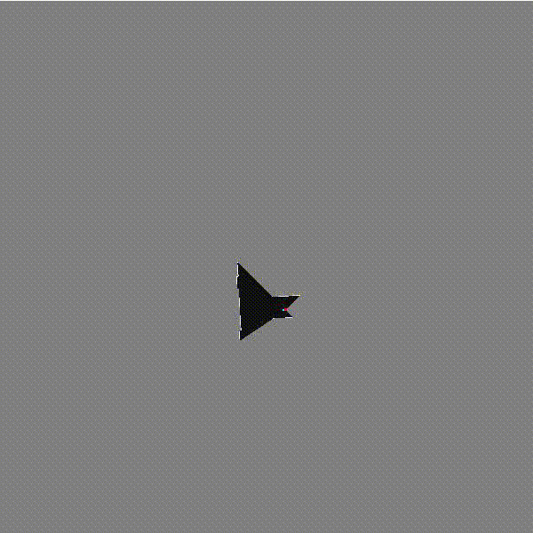

<a name="part2"/>
## Section 2: Loop Closure
One major problem with simple SLAM algorithms is the issue of loop closure. This occurs when the sensor travels for a relatively
long distance into new environments, and slowly minor positional errors in the mapping will result in the final map not adjusting
for a known position when it revisits an area. Below are some examples of maps with good loop closure:

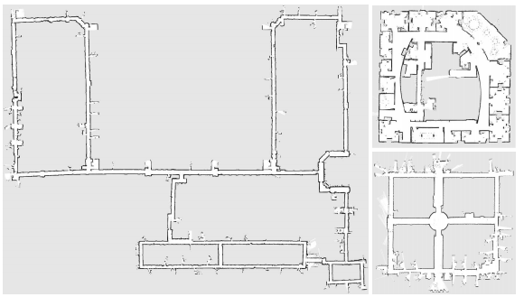

The most common method of active loop closure is to build a topology graph on top of the occupancy grid, and as new nodes are added,
try to merge nodes that are close in euclidean distance, but distance in graph distance.
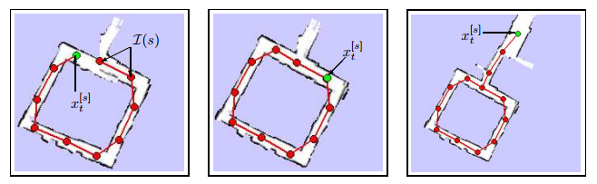

Here, we can see the current code inserting a new node onto the topology graph:
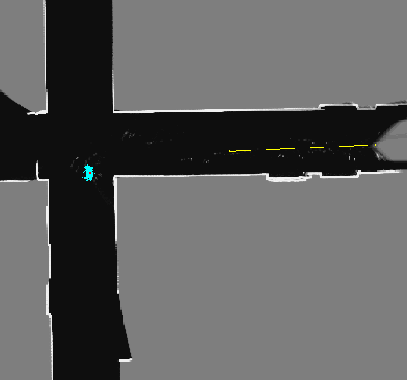

<a name="part3"/>
## Section 3: Moving from 2D to 3D
While loop closure is an important task for any robust slam application, in many applications, full 3D models of the mapped environment
are necessary. Unfortunately for the Occupancy Grid method, keeping a high degree of accuracy in a new dimension drastically increases
the memory footprint required due to the curse of dimensionality. To solve this, the occupancy grid can be converted into a set of points
stored in a KD tree for fast lookup (though not as fast as the direct lookup for an array storing all possible points).

This means that we can the same high level algorithm to perform the update steps on the data, withouth needing to store as many discrete points.
In this implementation we assume no points are closer than 25 mm, and assume the cell is found if the sensor reading is within 12.5mm of any given
point in the point cloud.

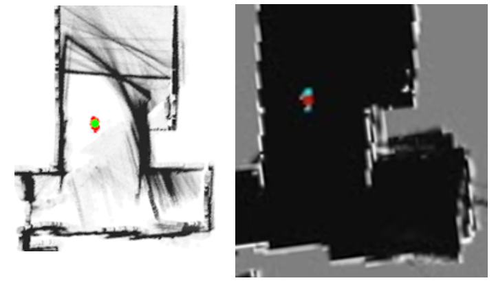

While collision detection worked well, the method for detecting free cells was less than ideal. This resulted in cells that only appeared for
a short period as being occupied were not being properly cleared, as scene above. This is likely due to the fact that free cells were calculed
using discrete points following Bresenham's line equation between two points, and this were likely not properly index to the correct correspondances.
One would have expected that this would have a significant effect in all the maps, but it only seemed to be a detriment in the second map, where
the robot positions would get "stuck" in hallways without distinct corner features to grab on to.

### Final Maps
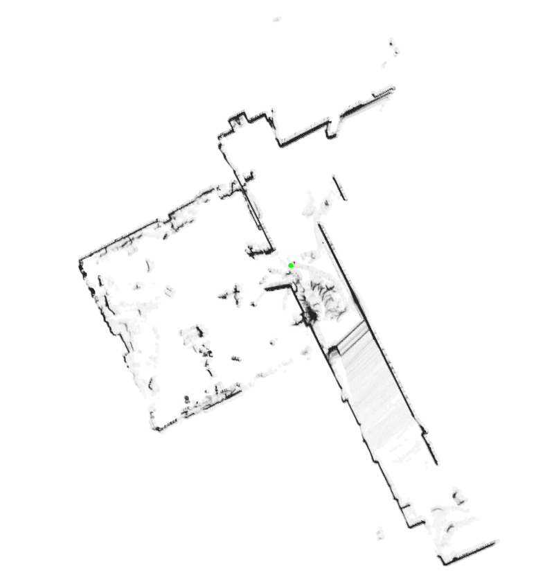
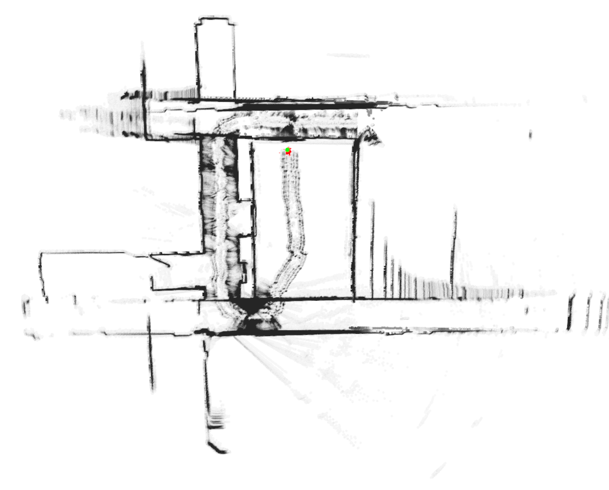
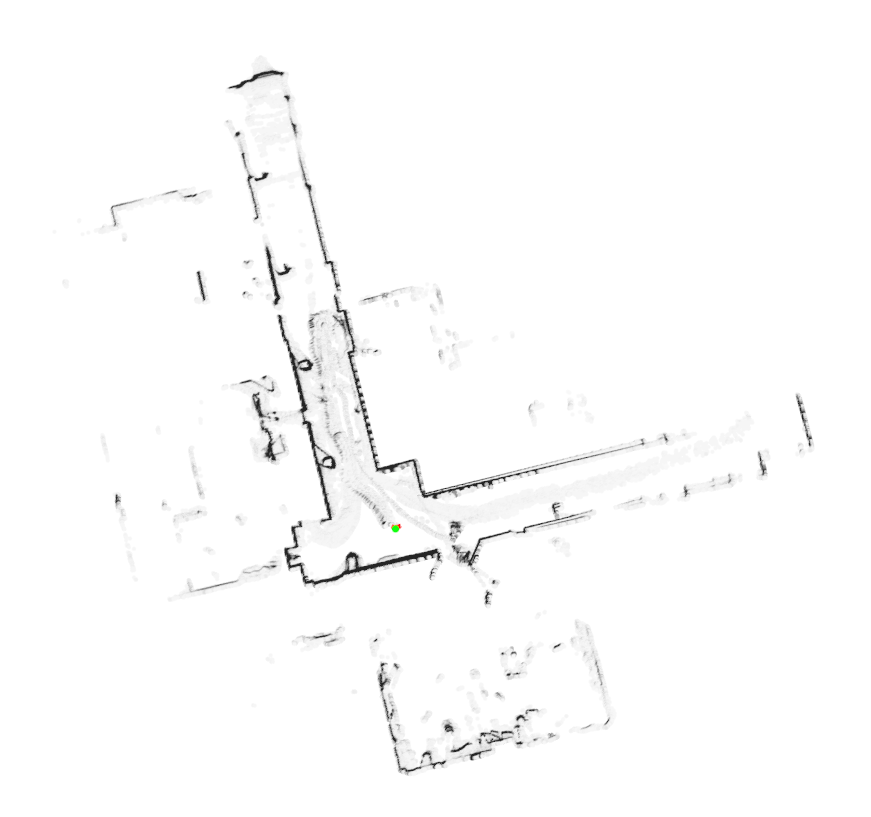
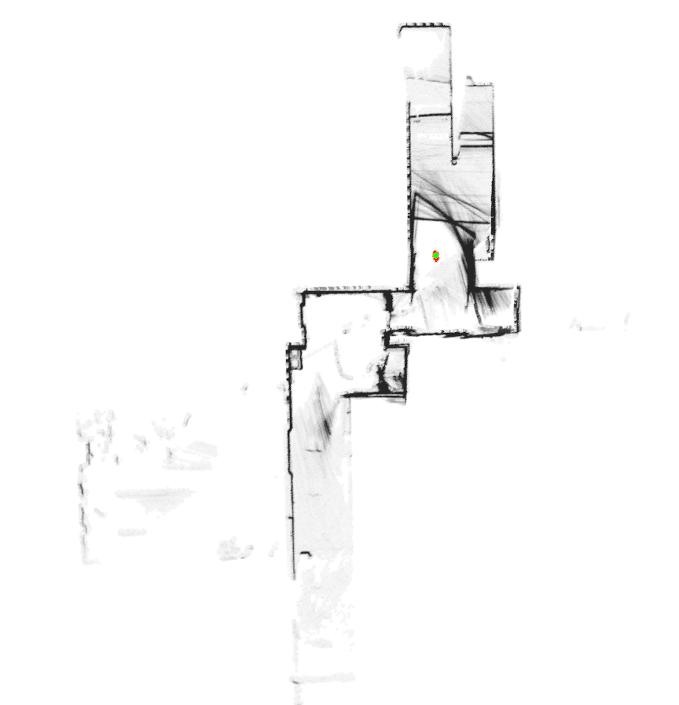
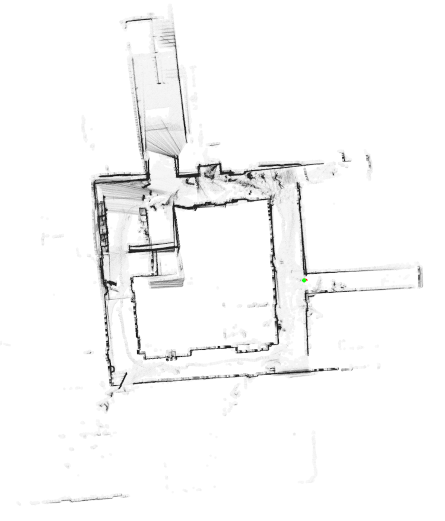

<a name="part4"/>
## Section 4: Error Correction with Regression
One major advantage of using the pointcloud over the occupancy grid, is that it allows for integration with common 3D registration techniques
used in other computer vision alogrithms. Particularly in this case, once the best particle has been selected, some additional corrections on
the robot position by running a single least-squares regression pass. The computation has shown little overhead relative to the more time consuming
steps of updating the map and evaluating particles.

If further improvements could be made to this algorthm, such as point-to-plane, non-linear regression, scale invariant feature transformation, or color
alignement from camera data, this could be used for better correction with fewer data points in the point cloud, as well as less reliance on dense
particle clouds for accounting for minor position differences.

<a name="part5"/>
## Section 5: Performance Analysis
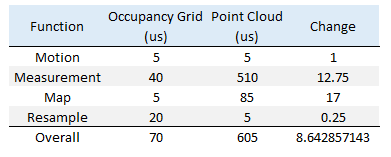

Since the Resampling and Motion Update steps are identical between the occupancy grid and point cloud implementations, there was little effect on the 
performace as we can see from table above (both functions were between 5 and 30 microseconds depending on the trial). The biggest slowdown was seen during
the measurement and map update steps of the process, showing a 13 fold and 17 fold increase in runtime respectively.

For the Measurement phase, the obvious source of the time was the search through the KD tree to detect correspondences and evaluate the particle for
fit to the current sensor reading. The first implementation of the particle measurement phase did not use dynamic parallism, so correspondences for
each of the 1080 sensor data points were done sequentially. Analysis for time improvements from using CUDA's dynamic parallelism in more recent video
cards is included below, but due to small errors in registration values (~5% difference between parallel and sequential versions), the implementation 
did not generate accurate maps due to selecting poor particles. 

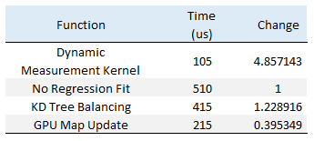

With the inclusion of dynamic kernel launches and kd-tree balancing, we see fairly substantial speedup, but still not at the 40Hz requirement for 
true realtime operation (though I believe further optimization of the visualization process and measurement step could fix this). We do see substantial
drop off in performance around 2000 particles, however, once we include the dynamic kernel launches. Implementations without this show runtime saturation
up to ~15,000 particles. Additionally, as long as the topology update phase is not checking visual occlusion, there is no significant overhead from running
loop closure checks.

One runtime test was to see if the error correction phase was addinng significant overhead, though for a single calculation per sensor reading, the
overhead was less than the accuracy of the clock used for timing measurements.

Periodically rebalancing the kd-tree holding the point cloud once every 100 cycles did show about a 22% speedup in the map update phase, implying that
further optimization of the search process could result in more significant improvements. The 3D slam solution from Ji Zhang and Sanjiv Singh [2] only
perform map updates infrequently with best in class results, so more investigation is necessary.

The map update phase was also a substantial overhead when moving to the point cloud implementation, mostly due to the fact that new points needed to
be added to the KD-tree sequentially. The table below shows that the code runs 60% slower when trying to force as much of the computation to the GPU as
possible, showing that the overall fast single threaded speed overshadows the work reduction from the GPU implementation. As a result, the fully CPU method
was used for map update timings.

active loop closure checks on the map as it is being built.

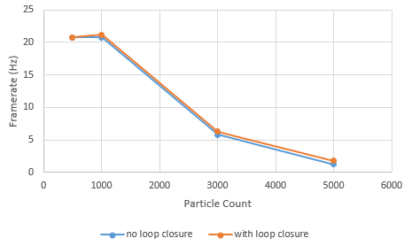

<a name="reference"/>
## References:
1.	G. Grisetti et al. <a href="http://www2.informatik.uni-freiburg.de/~grisetti/pdf/grisetti06jras.pdf">Fast and Accurate SLAM with Rao-Blackwellized Particle Fitlers</a>. Robotics and Autonomous Systems. Volume 55, Issue 1, 31 January 2007. 

2.	Ji Zhang and Sanjiv Singh. <a href="http://www.frc.ri.cmu.edu/~jizhang03/Publications/AURO_2016_2.pdf">Low-drift and Real-time Lidar Odometry and Mapping</a>. Autonomous Robots. 2016. 

<a name="appendix"/>
## Appendix: Build Instructions
* `src/` contains the source code.

This code requires the matlab runtime library for C++ to be installed on the machine. Make sure that the matlab library path
is included in Project>Properties>Configuration Properties>Debugging "Environment". E.G.:

> PATH=%PATH%;C:\Program Files\MATLAB\R2015a\bin\win64;

Additionally, the point cloud data is rendered using PCL. The all in one installer here was used: http://unanancyowen.com/en/pcl18/
however, there were some issues with the included Boost library, and may need to be updated per machine configuration. URMV.

Once compiled, the executable requires two input files: a text file specifying camera data and a matlab file containing lidar scans.
See the 'data' folder for examples of both.

**CMake note:** Do not change any build settings or add any files to your
project directly (in Visual Studio, Nsight, etc.) Instead, edit the
`src/CMakeLists.txt` file. Any files you add must be added here. If you edit it,
just rebuild your VS/Nsight project to make it update itself.

**If you experience linker errors on build related to the compute capability during thrust calls, edit the project to include the CUDA
library 'cudadevrt.lib'**

#### Windows

1. In Git Bash, navigate to your cloned project directory.
2. Create a `build` directory: `mkdir build`
   * (This "out-of-source" build makes it easy to delete the `build` directory
     and try again if something goes wrong with the configuration.)
3. Navigate into that directory: `cd build`
4. Open the CMake GUI to configure the project:
   * `cmake-gui ..` or `"C:\Program Files (x86)\cmake\bin\cmake-gui.exe" ..`
     * Don't forget the `..` part!
   * Make sure that the "Source" directory is like
     `.../Project5-Particle-Filter-SLAM`.
   * Click *Configure*.  Select your version of Visual Studio, Win64.
     (**NOTE:** you must use Win64, as we don't provide libraries for Win32.)
   * If you see an error like `CUDA_SDK_ROOT_DIR-NOTFOUND`,
     set `CUDA_SDK_ROOT_DIR` to your CUDA install path. This will be something
     like: `C:/Program Files/NVIDIA GPU Computing Toolkit/CUDA/v7.5`
   * Click *Generate*.
5. If generation was successful, there should now be a Visual Studio solution
   (`.sln`) file in the `build` directory that you just created. Open this.
   (from the command line: `explorer *.sln`)
6. Build. (Note that there are Debug and Release configuration options.)
7. Run. Make sure you run the `cis565_` target (not `ALL_BUILD`) by
   right-clicking it and selecting "Set as StartUp Project".
   * If you have switchable graphics (NVIDIA Optimus), you may need to force
     your program to run with only the NVIDIA card. In NVIDIA Control Panel,
     under "Manage 3D Settings," set "Multi-display/Mixed GPU acceleration"
     to "Single display performance mode".

#### OS X & Linux

This build has not been tested on OS X or Linux. Since lidar data is loaded from a matlab file, the 
user is responsible for linking the appropriate libraries to compile. Additionally, the user is responsible
for getting compatible versions of pcl.